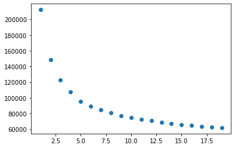
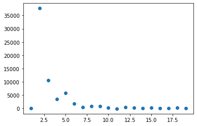
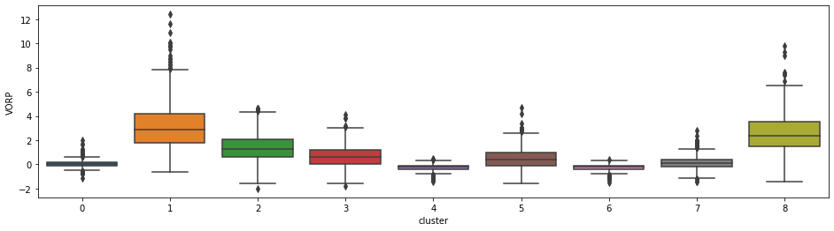
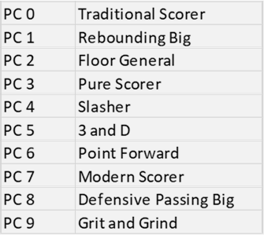
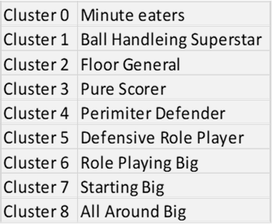

## Unsupervised Machine Learning for NBA Stats

### Primary Objective

Using [Unsupervised Machine Learning](NBA_PCA.ipynb) to analyze trends of athletes regression in NBA based on player archetype.

#### Principal Component Analysis

- Calculated variances to determine that **10** principal components is the optimal number for this model. 

#### Clustering using K-Means

- Using KMeans and in depth examination of the second derivative we conclude that the optimal number of clusters for this model is **9.**

##### Second Deriv to narrow down K value.

- Vizualising clusters to determine player archetypes

- By using, 'cluster_centers\_', 'components\_' and vectorize the player archetype in each cluster. This is be use to conclude on if our clusters are truly different.

### Interpreting Clusters

**PCA Playing Styles**

**Cluster Player Types**

#### Timeseries

- We uses the same cluster that we previously used.
- Compared the T0 to T1 and confirm if there is a variation
- Then we created a DataFrame for those that improved and those who regressed.

#### What is the model's accuracy?

From the two references at the bottom of this file, we should have an accuracy between 75% and 90%. For the timeseries, we stopped at 0.9148 which was 10 clusters to explain our model. This means we would have to find 10 styles of playing that result to a high or low VORP.

### References

- Kaggle - https://www.kaggle.com/drgilermo/nba-players-stats?select=player_data.csv-

Model 1: https://github.com/micahmelling/player_decline
Article: https://www.baseballdatascience.com/machine-learning-to-predict-player-decline/

Model 2: https://towardsdatascience.com/redefining-nba-player-classifications-using-clustering-36a348fa54a8

This section was completed by:

- Josh B.
- Pierre-Olivier B.
